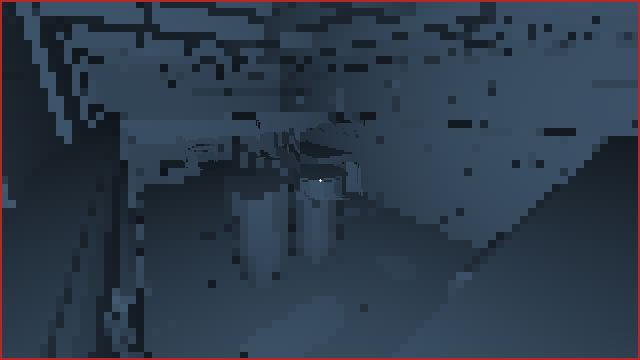
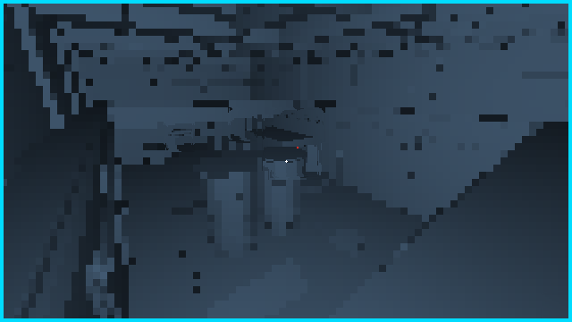
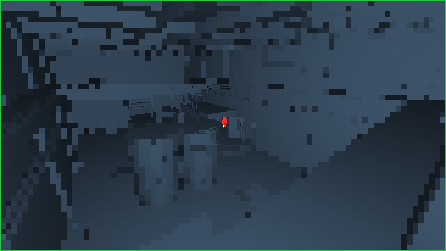
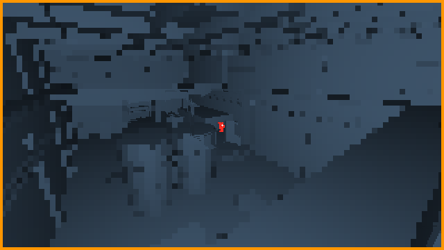
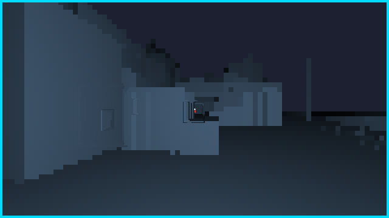
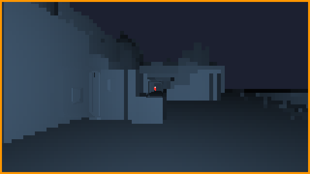
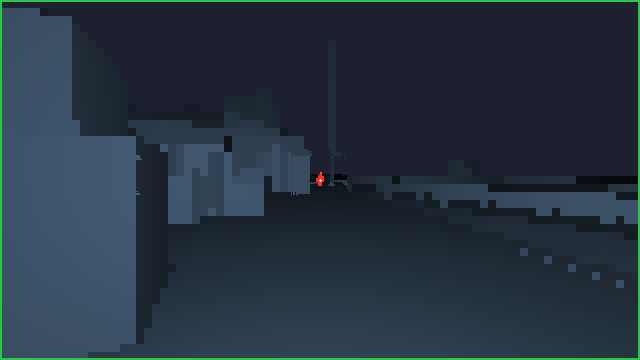

# cyka2pp

**cyka** + **CS2** + **C++** (`pp`) — the CS2 demo analyzer for
[cykaslayer.com](https://cykaslayer.com).

I aggregated several open-source CS2 parsers/analyzers into **one** translated
C++ project (with Cursor’s help) so the site has a single binary to call:
parse a `.dem`, compute scoreboard / aim / highlights, emit JSON for the
existing TypeScript services (or a human-readable table for local debugging).

I chose C++ because that is what I know well, and because extending the
pipeline (new tags, metrics, mesh LOS, etc.) is faster for me in this language
than maintaining a multi-repo Go/Python/TS stack.

## Features


| Area                             | What you get                                                                                                                               |
| -------------------------------- | ------------------------------------------------------------------------------------------------------------------------------------------ |
| **Demo parse**                   | PBDEMS2 stream, snappy frames, game events, string tables, Source 2 entity / sendtable decode, per-tick player poses                       |
| **Match model**                  | Roster (incl. disconnects), rounds / scores / half scores, kills, damages, flashes, bomb, utility                                          |
| **Scoreboard**                   | K/A/D, ADR, HS%, KAST, HLTV-style rating (Rtg), trades                                                                                     |
| **Clutches**                     | Once-per-round 1vN detection + win rates                                                                                                   |
| **Aim (needs** `--maps-dir`**)** | Median time-to-damage (per-tick LOS), accuracy, spray, counter-strafe %, spotted accuracy, crosshair placement, round swing, kill `ttd_ms` |
| **Highlights**                   | Clip windows + emoji kill tags (see below)                                                                                                 |
| **Output**                       | ANSI table and/or JSON                                                                                                                     |


Mesh LOS uses DLT1 `.tri` maps + BVH raycasts (batched / multi-threaded).
Player duck amount from the demo scales hitboxes / eye height and selects
locomotion clips (`idle` / `run` / `crouch` / `crawl`) for POV dumps when
player glTFs are present under `--maps-dir`. Default TTD/POV grid is **640×360**.

## Local CS2 asset folder (`--maps-dir`)

cyka2pp **never** ships Valve game files. You build a private asset directory
on your machine (any path; a common name is `cs2-maps-tri` next to this repo)
and pass it with `--maps-dir` / `CYKA2PP_MAPS_DIR`. Keep that folder out of git.

### Layout

```
<maps-dir>/
  de_nuke.tri                 # required for mesh LOS / TTD on that map
  de_mirage.tri               # …one DLT1 .tri per map you analyze
  …
  players/
    ct_sas.glb                # optional — POV victim mesh (CT)
    t_phoenix.glb             # optional — POV victim mesh (T)
  weapons/
    ak47.glb                  # optional — worldmodels on wpnPivot
    awp.glb
    …                         # see scripts/export_cs2_assets.sh for the full set
```

Exports are **geometry only** (no materials/textures). cyka2pp raycasts meshes; it
never samples PNGs.
- **Without** `.tri` files: parse/scoreboard/highlights still work; aim metrics
  that need walls (TTD, spotted, …) degrade or skip mesh occlusion.
- **Without** `players/*.glb`: POV dumps use duck-scaled capsules only.
- **Without** `weapons/*.glb`: skinned victims render without a held gun.

### 1. Install Source 2 Viewer CLI

Download `cli-linux-x64.zip` (or your OS) from
[ValveResourceFormat releases](https://github.com/ValveResourceFormat/ValveResourceFormat/releases)
and put `Source2Viewer-CLI` on your `PATH`. Docs: [s2v.app](https://s2v.app).

Point `CS2_ROOT` at your CS2 install if it is not the Steam default:

```bash
export CS2_ROOT="$HOME/.local/share/Steam/steamapps/common/Counter-Strike Global Offensive"
export CSGO="$CS2_ROOT/game/csgo"
```

### 2. One-shot export (recommended)

From this repo (writes **outside** cyka2pp by default):

```bash
chmod +x scripts/export_cs2_assets.sh
# argument = asset root (create it anywhere you like; do not put it inside cyka2pp)
./scripts/export_cs2_assets.sh "$HOME/cs2-maps-tri"
```

That script exports:

| Piece | Source | Output |
| ----- | ------ | ------ |
| Players + 4 locomotion clips | `pak01_dir.vpk` agents | `players/{ct_sas,t_phoenix}.glb` |
| Weapon worldmodels | `pak01_dir.vpk` weapon models | `weapons/{ak47,awp,…}.glb` |
| Map collision `.tri` | via [demolens](https://github.com/f-gillmann/demolens) `extract-map` if installed | `<map>.tri` (+ `maps/` copies) |

If demolens is missing, players/weapons still export; add map `.tri` files
yourself (next section).

### 3. Maps → DLT1 `.tri` (LOS / TTD)

cyka2pp loads **DLT1** triangle soups (`"DLT1"` magic + `uint32` count +
`float32` xyz×3 per triangle). File name must match the demo map
(`de_nuke.tri` for `de_nuke`).

With demolens:

```bash
demolens extract-map \
  --cs2 "$CS2_ROOT" \
  --map de_nuke \
  --out-dir "$HOME/cs2-maps-tri/maps" \
  --vrf Source2Viewer-CLI
# cyka2pp expects the .tri at the maps-dir root:
ln -sfn maps/de_nuke.tri "$HOME/cs2-maps-tri/de_nuke.tri"
```

Manual path: export `maps/<map>/world_physics.vmdl_c` from `maps/<map>.vpk`
with Source2Viewer-CLI, then convert to DLT1 (demolens `extract-map` is the
usual converter).

### 4. Players / weapons by hand (optional)

Same files the script writes — useful if you only need one agent or gun:

```bash
ANIMS='animation/anims/world/rifle/_default_rifle/idle_rifle,animation/anims/world/rifle/_default_rifle/run_n_rifle,animation/anims/world/rifle/_default_rifle/idle_crouch_rifle,animation/anims/world/rifle/_default_rifle/crouch_n_rifle'
MAPS="$HOME/cs2-maps-tri"
mkdir -p "$MAPS/players" "$MAPS/weapons"

Source2Viewer-CLI -i "$CSGO/pak01_dir.vpk" \
  -f "agents/models/ctm_sas/ctm_sas.vmdl_c" \
  -o "$MAPS/players/ct_sas.glb" -d \
  --gltf_export_format glb --gltf_export_animations \
  --gltf_animation_list "$ANIMS" --gltf_export_materials

Source2Viewer-CLI -i "$CSGO/pak01_dir.vpk" \
  -f "agents/models/tm_phoenix/tm_phoenix.vmdl_c" \
  -o "$MAPS/players/t_phoenix.glb" -d \
  --gltf_export_format glb --gltf_export_animations \
  --gltf_animation_list "$ANIMS" --gltf_export_materials

# worldmodels (examples)
Source2Viewer-CLI -i "$CSGO/pak01_dir.vpk" \
  -f "weapons/models/ak47/weapon_rif_ak47.vmdl_c" \
  -o "$MAPS/weapons/ak47.glb" -d --gltf_export_format glb --gltf_export_materials
```

Weapon slugs cyka2pp looks for (export script writes these): rifles (`ak47`,
`m4a4`, `m4a1`, `famas`, `galilar`, `aug`, `sg556`), snipers (`awp`, `ssg08`,
`scar20`, `g3sg1`), pistols (`deagle`, `glock`, `usp`, `hkp2000`, `p250`,
`fiveseven`, `tec9`, `cz75a`, `elite`, `revolver`), SMGs / shotguns / heavy
(`mp9`, `mac10`, `mp7`, `ump45`, `p90`, `bizon`, `mp5sd`, `nova`, `xm1014`,
`mag7`, `sawedoff`, `m249`, `negev`).

### 5. Clip ↔ demo (POV)

| Clip   | Animation basename   | Demo rule |
| ------ | -------------------- | --------- |
| idle   | `idle_rifle`         | duck &lt; 0.55 and speed &lt; ~90 u/s |
| run    | `run_n_rifle`        | standing and speed ≥ ~90 u/s |
| crouch | `idle_crouch_rifle`  | duck ≥ 0.55 |
| crawl  | `crouch_n_rifle`     | duck ≥ 0.70 and speed ≥ ~35 u/s |

Duck is pawn `m_flDuckAmount`; speed is horizontal u/s between pose samples.
Analyzer LOS still uses duck-scaled capsules; skinned mesh is POV-only (kill
victim), with optional gun on `wpnPivot`.

### 6. Run analyze with your folder

```bash
./build/cyka2pp analyze path/to/match.dem \
  --maps-dir "$HOME/cs2-maps-tri" \
  --ttd-trace-dir /tmp/ttd-traces \
  --format json --out /tmp/m.json
```

Do **not** commit or publish `.tri` / `.glb` / VPK extracts. They are derived
from your CS2 install for local analysis only. Always credit
[Source 2 Viewer](https://s2v.app) / ValveResourceFormat when you document the
pipeline.

## Install (production / container)

Prefer downloading a **release binary** — do not compile on the analyzer host.

1. Pick the artifact for your CPU:
  - `cyka2pp-linux-x86_64-v4` — best perf (needs AVX-512: Ice Lake / Zen 4+)
  - `cyka2pp-linux-x86_64-v3` — AVX2 / BMI2 (Haswell / Zen 2+ — good default for most VMs)
  - `cyka2pp-linux-x86_64-v2` — safest (SSE4.2 / most servers since ~2015)
2. Check CPU:
  - `grep -o 'avx512f' /proc/cpuinfo | head -1` → non-empty → **v4**
  - else `grep -o 'avx2' /proc/cpuinfo | head -1` → non-empty → **v3**
  - else → **v2**
3. Install:

```bash
# on the analyzer container/host
VER=v0.1.10   # ← set to the GitHub release tag
ARCH=v3      # v2 | v3 | v4
ASSET=cyka2pp-linux-x86_64-${ARCH}

curl -fsSL -o /usr/local/bin/cyka2pp \
  "https://github.com/LH-Lawliet/cyka2pp/releases/download/${VER}/${ASSET}"
chmod +x /usr/local/bin/cyka2pp
cyka2pp -h
```

Binaries are built with **static libstdc++ / libgcc** and a **static snappy**;
they still need a normal glibc (Ubuntu/Debian). No `apt install snappy` required.

Analyzer env:

```bash
export CYKA2PP_BIN=/usr/local/bin/cyka2pp   # optional if on PATH
export CYKA2PP_MAPS_DIR=/path/to/maps       # your private --maps-dir (see above)
```


## Cutting a release (GitHub)

CI runs on every PR (`ci.yml`). Publishing binaries:

```bash
# from a clean main with the version you want
git tag v0.1.0
git push origin v0.1.0
```

That triggers `.github/workflows/release.yml`, which builds **v2 + v3 + v4**, runs
unit tests on v2, and attaches binaries (+ `.sha256`) to the GitHub
Release for that tag.

> **Note:** v3/v4 builds use `-march=x86-64-v{3,4} -mno-avx`. Plain AVX codegen
> currently miscompiles the entity bit reader (junk roster + zero spray angles).
> BMI2 and other v3 features stay enabled.

You can also run the **Release** workflow manually (Actions → Release → Run
workflow) to build artifacts without tagging; tagged pushes create the Release.

## Requirements (local build)

```bash
sudo pacman -S cmake ninja nlohmann-json snappy clang
# or: cmake with -DCYKA_FETCH_DEPS=ON (fetches nlohmann_json + snappy)
```


## Build

```bash
cd ~/demo_go/cyka2pp
cmake -G Ninja -B build -DCMAKE_BUILD_TYPE=Release -DCMAKE_CXX_COMPILER=clang++
cmake --build build
ctest --test-dir build --output-on-failure

# CI-style (fetched deps + static libstdc++ + march):
cmake -G Ninja -B build-rel \
  -DCMAKE_BUILD_TYPE=Release -DCMAKE_CXX_COMPILER=clang++ \
  -DCYKA_FETCH_DEPS=ON -DCYKA_STATIC=ON -DCYKA_MARCH=x86-64-v2
cmake --build build-rel
```


## CLI

```bash
# Table (default on a TTY). Needs meshes for TTD / LOS aim columns.
./build/cyka2pp analyze ../dotdem/3835689269611987518.dem \
  --maps-dir "$HOME/cs2-maps-tri" \
  --format table

# All table sections
./build/cyka2pp analyze path/to/demo.dem \
  --maps-dir "$HOME/cs2-maps-tri" \
  --format table --sections all

# Subset: scoreboard,clutches,aim,highlights,rounds,kills
./build/cyka2pp analyze path/to/demo.dem --format table \
  --sections scoreboard,highlights

# JSON to stdout (default when not a TTY)
./build/cyka2pp analyze path/to/demo.dem \
  --maps-dir "$HOME/cs2-maps-tri" \
  --format json --minify

# JSON to a file (implies JSON if --format omitted)
./build/cyka2pp analyze path/to/demo.dem \
  --maps-dir "$HOME/cs2-maps-tri" \
  --out match.json --minify

# POV / TTD drawings (shooter view + walls/smoke; open testdata/ttd-traces/index.html)
./build/cyka2pp analyze testdata/demos/3835689269611987518.dem \
  --maps-dir "$HOME/cs2-maps-tri" \
  --ttd-trace-dir testdata/ttd-traces --format json --out /tmp/m.json
```

`--format table` with `--out` prints the table and still writes JSON.

## How time-to-damage (TTD) works

TTD answers: *once the shooter can see the victim, how long until the bullet
lands?* Spotted accuracy, crosshair placement, and counter-strafe share the
**same** per-tick visibility test.

### 1. Shared WxH shooter grid

Every analyzed tick, for each (shooter → enemy) pair we care about, we cast
rays through a fixed **16:9** camera grid (default `--ttd-size 640x360`,
same FOV as GOTV). That grid is the single source of truth for:


| Metric                  | Uses visibility how                                       |
| ----------------------- | --------------------------------------------------------- |
| **TTD / kill** `ttd_ms` | Walk backward from damage/kill while continuously visible |
| **Spotted accuracy**    | Shot counts only if an enemy is visible that tick         |
| **Crosshair placement** | Angle to the nearest visible enemy hitbox                 |
| **Counter-strafe**      | Rifle shot while visible + moving slowly enough           |


Rays are **AABB-scoped**: we only cast pixels that can touch the projected
player hitboxes (18 standing capsules), with a small pad so limb edges still
count — not the whole 640×360 image.

### 2. Hitbox before mesh

For each candidate pixel:

1. Build a camera ray.
2. Intersect the enemy’s **world capsules** first (cheap).
3. Only if a capsule is hit, ask the map BVH whether a wall is **closer**
  (`occluded` along the segment). Miss the body → skip the mesh entirely.

GOTV often repeats the same pose for many ticks; we **reuse** the last
visibility bit when shooter/enemy geometry is unchanged, and memoize
`(pair, tick)` results. Independent lookbacks run on a small thread pool.

### 3. Event-driven lookback (not a full-match precompute)

We do **not** precompute all-pairs visibility for the whole demo. Instead:

1. Sort damages (and kills) in time.
2. For each attacker→victim pair, take the first usable event.
3. Walk **backward** tick-by-tick while `visible` stays true.
4. Cap lookback with `--ttd-max-lookback` (default **2s**). If they are
  still continuously visible at that floor, we **omit** TTD (hold too long to
   score). Spotted / crosshair / CS are unaffected by that cap.


### 4. Reading a TTD strip

`--ttd-trace-dir` writes one BMP per tick around selected kills, plus a small
viewer (`testdata/ttd-traces/index.html`). Dumps use the **same** frustum and
LOS as the analyzer, but spend pixels **where players are**:

- wide soft halo around projected enemies (full res in duel/mid range)
- stride grows with distance; empty background stays a coarse lattice

Example — AWP kill (Nuke demo in `testdata/demos/`). Stills below are from the
default **640×360** dump:


| Before first sight                       | First continuous sight (`VIEW`)              |
| ---------------------------------------- | -------------------------------------------- |
|  |  |


| Tracking (TTD clock running)           | Kill / shot tick               |
| -------------------------------------- | ------------------------------ |
|  |  |


Another example — Desert Eagle (first sight → shot):


| First sight                                      | Shot                                     |
| ------------------------------------------------ | ---------------------------------------- |
|  |  |

Crouch/crawl scales the red hitbox (demo duck). Example at duck≈0.85:



Open the full strip gallery: `testdata/ttd-traces/index.html` (captions show `idle|run|crouch|crawl dNN`).


In the viewer: **cyan** = first victim pixel on screen, **green** = TTD clock
running, **orange** = kill/shot tick, **red** = not counting. The kill victim is
a skinned glTF player (optional worldmodel on `wpnPivot`); other enemies stay
duck-scaled capsules. Grey haze is smoke; white cross is view center.

```bash
# Regenerate the local gallery (BMPs are gitignored; PNGs above are committed)
./build/cyka2pp analyze testdata/demos/3835689269611987518.dem \
  --maps-dir "$HOME/cs2-maps-tri" \
  --ttd-trace-dir testdata/ttd-traces \
  --format json --out /tmp/m.json
# then open testdata/ttd-traces/index.html
```


### Perf notes

Measured on an **AMD Ryzen 7 5800X** (8C/16T), Release build, mid Nuke demo
(`testdata/demos/3835689269611987518.dem`, `--maps-dir` meshes loaded):


| Mode                                                    | Wall       |
| ------------------------------------------------------- | ---------- |
| `analyze` (default 640×360), no traces                  | **~5.2s**  |
| same + `--ttd-trace-dir` @ 320×180 (~425 frames)        | **~7.8s**  |
| same + `--ttd-trace-dir` @ 640×360 (~430 frames)        | **~10.5s** |


Analyze time is after the visibility opts (hitbox-before-mesh, pose reuse,
memoized lazy batch, parallel lookbacks). Rays stay AABB-scoped, so the default
grid size barely moves analyze wall; POV dumps shade adaptive images (victim
skinned mesh, others capsules, frames parallelized).

## Demo corpus and cross-parser checks

Demos are **not** in git (tens–hundreds of MB). Manifest: `testdata/corpus/manifest.json`.

```bash
python3 scripts/fetch_corpus.py
ctest --test-dir build --output-on-failure   # skips missing .dem files

# Optional: pip install awpy
python3 scripts/compare_analyzers.py --bin ./build/cyka2pp --maps-dir "$HOME/cs2-maps-tri"
```


| kind                      | what                                                            |
| ------------------------- | --------------------------------------------------------------- |
| `pro`                     | HLTV (Awpy fixture: Vitality vs Spirit, IEM Katowice 2025 Nuke) |
| `competitive` / `premier` | Valve GOTV (`match730_…` MM + ranked 11–13 Nuke)                |
| `faceit`                  | FACEIT room demo from Awpy                                      |
| `forfeit`                 | early surrender 2–0                                             |


Official **Wingman** GOTV files are not redistributed publicly (Steam GCPD only). Drop a `*.dem` into `testdata/demos/` and add a `manifest.json` entry (`rankType` 7). Premier is `rankType` 11, competitive 12.

## Kill tag system

Each kill can collect zero or more emoji tags (joined for display / JSON).
Event flags come from the demo; pose / shot / TTD tags need samples (and mesh
for ⚡).


| Tag | Meaning                  | Rule (short)                                                       |
| --- | ------------------------ | ------------------------------------------------------------------ |
| 🎯  | Headshot                 | `is_headshot`                                                      |
| 🧱  | Wallbang                 | `penetrated_objects > 0`                                           |
| 💨  | Through smoke            | `is_through_smoke`                                                 |
| 🙈  | Blind kill               | killer flashed                                                     |
| 🦅  | Airborne                 | killer airborne near kill tick                                     |
| 🔭  | No-scope                 | `is_no_scope`                                                      |
| ☝️  | One-tap                  | HS with exactly one shot in the last ~1 s (excl. snipers/shotguns) |
| 💫  | Flick                    | large yaw change in ~0.1 s before the kill                         |
| 🥶  | Cold blood / last bullet | ammo model hits 0 on the kill shot                                 |
| 🚑  | 1 HP                     | killer health == 1 near kill                                       |
| ✈️  | Long range               | distance > 30 m (50 m if scoped)                                   |
| 🎳  | Collateral               | ≥2 kills same tick / same killer                                   |
| ⚡   | Fast TTD                 | kill `ttd_ms` < 100                                                |


Implementation: `src/highlights/tags.cpp` + `tag_rules.cpp`.

## Layout

Translation units aim to stay under ~200 lines.

```
include/cyka/     public API (analyze, models, options)
src/demo/         PBDEMS2 + entities + match builder
src/geom/         DLT1 mesh + BVH
src/metrics/      KAST / HLTV ratings, clutches, swing
src/aim/          samples, batched LOS, TTD / spray / CS / …
src/highlights/   clip windows + tags
src/io/           JSON
src/render/       ANSI tables
tests/            unit + golden demo checks
```


## Sources (all MIT — this project is MIT)

Algorithms and semantics were reimplemented / adapted from:

- [demoinfocs-golang](https://github.com/markus-wa/demoinfocs-golang) — demo / sendtable / entity decode semantics (C++ port under `src/demo/ent`)
- [demolens](https://github.com/f-gillmann/demolens) — DLT1 mesh, BVH occlusion, spray tables, aim metric ideas
- [cs-demo-analyzer](https://github.com/akiver/cs-demo-analyzer) — scoreboard / export-oriented formulas cross-check
- [awpy](https://github.com/pnxenopoulos/awpy) — parsing / stats cross-check

This tree does **not** vendor those repos; it is a single controlled C++ surface for cykaslayer.

## License

MIT — see [LICENSE](LICENSE).
